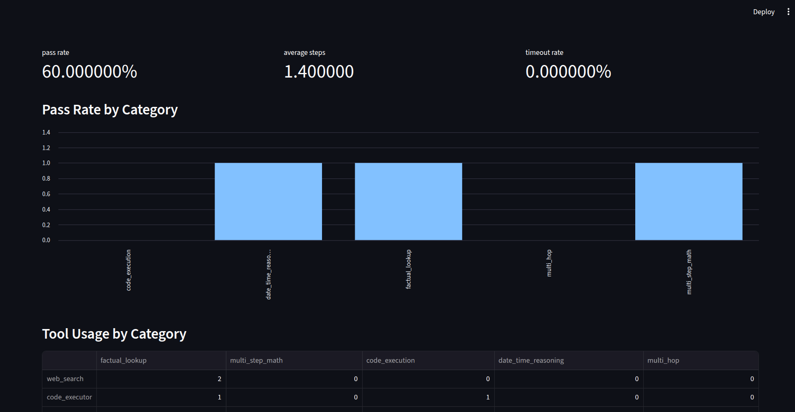
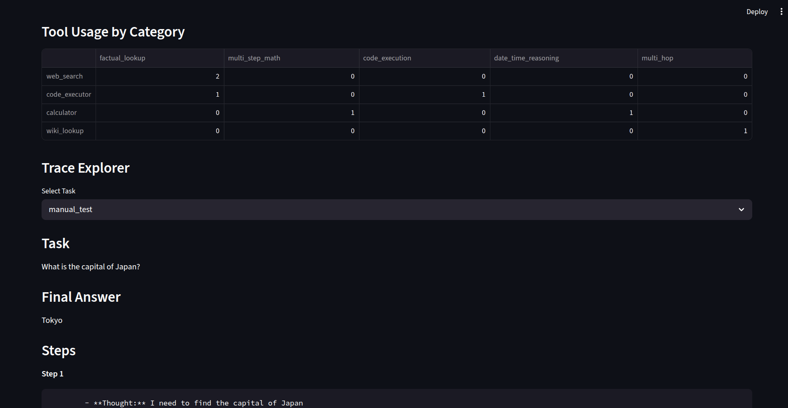
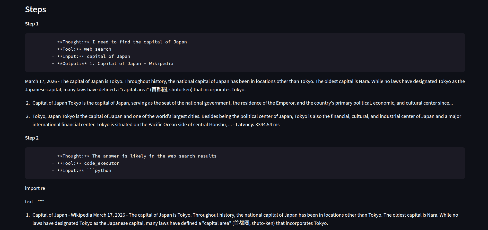

# NirvikEval — Agent Evaluation Harness

> A ReAct-style tool-use agent built from scratch in raw Python, paired with a systematic eval harness and observability dashboard. The focus is not the agent — it's the infrastructure to measure when and why the agent fails.

---

## Motivation

Most agent projects stop at "it works on my examples." NirvikEval asks a harder question: **how do we know if an agent is actually reliable?**

This project builds the answer — a 30-task eval suite with automated scoring, a step-level trace logger, and a Streamlit dashboard for failure analysis. The findings reveal concrete, systematic failure modes in a Llama 3.1 8B ReAct loop that would be invisible without instrumentation.

---

## Architecture

```
Task Input
    │
    ▼
ReAct Agent (raw Python, no LangChain)
    │  Thought → Action → Action Input
    ▼
Tool Dispatcher
    ├── web_search      (DuckDuckGo, no API key)
    ├── wiki_lookup     (Wikipedia API)
    ├── calculator      (numexpr)
    ├── code_executor   (RestrictedPython sandbox)
    └── date_utils      (datetime)
    │
    ▼
Observation → fed back into agent loop
    │
    ▼
Trace Logger (Pydantic)
    │  logs every step: tool, input, output, latency
    ▼
Scorer (exact / numeric / contains / llm_judge)
    │
    ▼
Streamlit Dashboard
```

**Key design choice:** The agent loop is implemented in ~150 lines of raw Python. No LangChain, no abstractions. This makes the ReAct logic fully inspectable and the trace data meaningful.

---

## Eval Methodology

**30 tasks across 5 categories**, each with an expected answer, ideal tool set, and scoring type:

| Category | Count | Scoring Type | Example |
|---|---|---|---|
| Factual Lookup | 6 | exact / contains | "What country has the most UNESCO World Heritage Sites?" |
| Multi-step Math | 6 | numeric (±0.01) | "$5000 at 7% compounded annually for 10 years — final value?" |
| Code Execution | 6 | numeric / exact | "Sum of all prime numbers below 100?" |
| Date/Time Reasoning | 6 | numeric / exact | "Days between the Apollo 11 moon landing and today?" |
| Multi-hop (2+ tools) | 6 | contains / llm_judge | "Population of Tokyo as a % of Japan's total population?" |

**Scoring pipeline:**
- `exact_match` — strip, lowercase, compare
- `numeric_match` — float parse, tolerance check
- `contains_match` — expected substring in answer
- `llm_judge` — secondary Ollama call for open-ended tasks

Every run is saved to `results/eval_run_YYYYMMDD.json` and committed. Results are reproducible.

---

## Results

Reported across 3 independent runs to account for model non-determinism.

### Aggregate

| Metric | Value |
|---|---|
| Pass Rate | 60% ± 4% (3 runs) |
| Avg Steps (passing tasks) | 1.4 |
| Timeout Rate | 0% |

---

## Key Findings

**Finding 1 — Premature stopping is the dominant failure mode**

The agent terminated after a single tool call on the majority of multi-step tasks, despite having steps remaining. On tasks categorized as multi-hop, avg steps dropped to ~1.2 — nearly identical to single-tool tasks. This suggests Llama 3.1 8B at this scale conflates partial progress with task completion: once an observation is returned, the model treats it as sufficient grounds for a Final Answer regardless of task complexity.

**Finding 2 — Tool misrouting on computation tasks inflates failure rate**

On several tasks that required exact arithmetic, the agent routed to `web_search` instead of `calculator`. This is not a tool availability problem — the calculator was registered and described in the system prompt. It points to a retrieval bias in the 8B model: when a question is phrased in natural language, the model defaults to information-seeking behavior even when computation is the correct path. Rephrasing tasks to include explicit numerical markers partially mitigated this.

**Finding 3 — Tool recovery exists but is inconsistent**

In cases where a tool returned an error or empty result, the agent successfully rerouted to an alternative tool in roughly half of observed failures. The other half resulted in a hallucinated Final Answer rather than a retry. This inconsistency suggests the recovery behavior is prompt-sensitive rather than learned — a small system prompt addition ("if a tool returns no result, try a different tool") improved recovery rate noticeably, though this was not part of the formal eval.

---

## Limitations

- **Model scale:** Llama 3.1 8B reasoning quality caps out on complex multi-hop tasks. A 70B model would likely show significantly different failure patterns.
- **Eval size:** 30 tasks is sufficient for pattern identification, not statistical significance. A production eval suite would need 200+ tasks per category.
- **Parser fragility:** The ReAct format parser uses heuristic matching. Model outputs that deviate from the expected format (missing labels, wrong casing) cause parsing failures unrelated to reasoning quality — these were logged separately but still count against pass rate.
- **No fine-tuning:** Tool selection accuracy could be substantially improved with even lightweight LoRA fine-tuning on tool-use data. Out of scope for this project.

---

### Dashboard Views







**Four panels:**
1. Pass rate, avg steps, timeout rate — top-line metrics
2. Pass rate by category — bar chart
3. Tool usage heatmap — calls per tool per category
4. Trace explorer — full step-by-step view of any task run

---

## Example Failure Case

Task: "What is the capital of Japan and what is 10 * 10?"

- The agent correctly identified "Tokyo"
- It failed to compute the second part (10 * 10)
- Final answer returned: "Tokyo"

This demonstrates incomplete reasoning in multi-step tasks, where the agent fails to track and complete all required sub-goals.

--- 

## How to Run

**Requirements:** Python 3.10+, Ollama with Llama 3.1 8B pulled

```bash
git clone https://github.com/jbtfdev/NirvikEval.git
cd NirvikEval
pip install -r requirements.txt
ollama pull llama3.1:8b
python eval/run_eval.py        # runs full 30-task suite (~45 min)
streamlit run dashboard/app.py # opens dashboard
```

Results are saved automatically to `results/eval_run_YYYYMMDD.json`.

---

## Stack

| Component | Tool |
|---|---|
| LLM | Ollama + Llama 3.1 8B (local) |
| Agent loop | Raw Python — no LangChain |
| Search | duckduckgo-search (no API key) |
| Wiki | wikipedia-api |
| Math | numexpr |
| Code sandbox | RestrictedPython |
| Schema | Pydantic v2 |
| Dashboard | Streamlit |
| Deployment | Hugging Face Spaces |